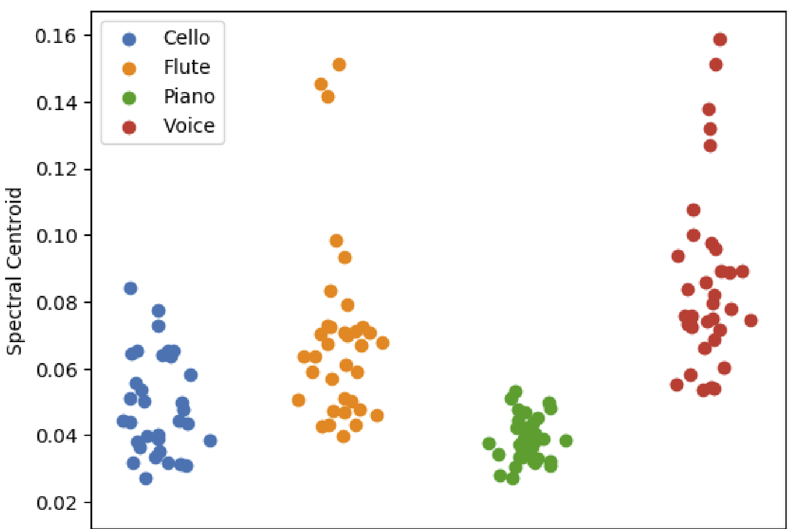

| [Homepage](https://dl4genaudio.github.io) | [Course content](https://dl4genaudio.github.io/#course-content) | [Spanish](https://dl4genaudio-github-io.translate.goog/features/?_x_tr_sl=auto&_x_tr_tl=es&_x_tr_hl=en-US&_x_tr_pto=wapp) |
# Audio Features and Musical Objects

## Human listening vs machine listening

Can a computer listen to musical sounds in the same way that humans do? Since the year 2000, this is a question that motivates the work by engineers and scientist in the field of Music Information Retrieval (MIR).

When listening a short excerpt of music, the average human can identify features such as the kinds of musical instruments played (Giordano & McAdams 2010), the beat or tempo (Large et al. 2015), and the genre of music (Mace et al. 2012). Moreover, all of us have met (or are) music fans who can identify more abstract features like (just to name some of the most obvious ones) artists and names of songs that they are familiar with.

In recent years, advances in MIR have resulted in numerous algorithms that allow machines to identify musical instruments, the tempo, the genre, the artist, or the name of a song. Some of these systems have even surpassed human performance levels.

How are these systems able to do carry out these tasks? In a nutshell, these systems, like the human brain, process and integrate features (i.e. the magnitude of a frequency band or the pitch of a sound) that meaningfully describe a musical object (i.e. the vowel and pitch of singing speech or the identity of an instrument).

## The problem of high dimensionality 

Audio signals are multidimensional (In practice, any datapoint with more than three dimensions is considered to be multidimensional). The three-dimension cutt-off is based on the fact that visualization of multidimensional data is imposible (we cannot see more than three dimensions at a given point in time).

Idealy, computers shold be able to process as many dimensions in data as there are available. This is what the human brain can efficiently, intelligently, and quickly do in real time 24/7 (optimally differentiating and attending meaningfull and meaningless information when carrying out a task, like listening). In practice, however, a computer's processing of multidimensional signals can be complicated for two main reasons: (1) handling more data requires more time and greater computational power, and (2) algorithms may treat all data equally, which means that a computer may not know how to identify the subset of dimensions that contain the most meaninfgul information.

A good MIR engineer must be able to identify ways to reduce the dimensionality of signals to develop algorithms that can intelligently process data. Dimensionality reduction is achieved via mathematical functions that take multiple data dimensions and calculate a single value or a small groups of values that tell us how the dimensions are related to each other. More intelligent MIR algorithms are achieved by better mimicking the listening mechanisms of the brain or harnessing the mathematical properties of data. First, we will review ways to reduce the dimensionality by extracting spectral features from digital audio data.

## Spectral features in time-series signals 

To simplify handling of long time-series signals (like audio), researchers can reduce the dimensionality by extracting features, one example of which are spectral features. Examples of spectral features include the [zero-crossing rate](https://librosa.org/doc/main/generated/librosa.feature.zero_crossing_rate.html), the [spectral centroid](https://librosa.org/doc/main/generated/librosa.feature.spectral_centroid.html), or the [spectral bandwidth](https://librosa.org/doc/main/generated/librosa.feature.spectral_bandwidth.html). Familiarize yourself with all the [spectral (and other) features](https://librosa.org/doc/main/feature.html#spectral-features) that you can easily extract using librosa.

## Mel-frequency Cepstral Coefficients

The Mel-frequency cepstral coefficients (MFCCs) are a set of very useful spectral features. MFCCs were designed to better represent how the human ear processes an audio signal (Mermelstein 1976). Experiments showed that humans tend to underestimate high frequency bandwidths compared to low frequency ones. Hence, MFCCs are obtained by filtering the spectrum of a signal with N equally-spaced frequency bands.

1. Compute the magnitude spectrogram of the signal and keep only the positive frequencies.
2. Find N equidistant center frequencies in the Mel scale to design bandpass filters, and convert them from the Mel scale to Hertz.
3. Generate the triangular overlapping windows of equally-spaced frequency bands.
4. Get the Mel spectrum: 
    * Compute the dot-product between the spectra and the Mel filters.
    * Get the log10 of the resulting values.
5. Compute the Discrete Cosine Transform of each time-bin.

## Dimensionality reduction via audio feature extraction

The figure below shows the power of audio features to reduce the dimensionality of audio signals, which can help us visualize the differences between discrete categories of audio sources.

The figure plots a single feature (the spectral centroid), extracted from signals produced by different musical instruments. This single feature allows for visual inspection of the quantitative properties that differentiate these musical instruments.

* Stop and think: could extracting more audio features allow for better visualization and separation of the same signals plotted in the figure above?

## Questions to think about:

* Why did we say that an object can be described by an infinite number of features?
* Which other audio or time-series features do you know about and how do they work?

# [Homework 2: Audio features](https://colab.research.google.com/github/dl4genaudio/assignments/blob/main/audio_features.ipynb)

due Feb 15th at 11:59PM ([Eastern Standard Time](https://www.timeanddate.com/time/zones/et))

* More things to do:
    * Find and read research papers that align with your interests in the proceedings of conferneces such as [ISMIR 2021](https://ismir2021.ismir.net/papers/), [CogMIR 2019](http://www.cogmir.org/wp-content/uploads/2019/08/CogMIR-2019-Program-Schedule.pdf), [ICASSP 2021](https://www.2021.ieeeicassp.org/2021.ieeeicassp.org/Papers/AcceptedPapers.html), [DAFX 2021](https://dafx2020.mdw.ac.at/proceedings/Proceedings_of_DAFx20in21.html), or do a search on google scholar for keywords that better match your interests within the scope of this course.

___

&copy; [Iran R. Roman](https://iranroman.github.io) 2022
