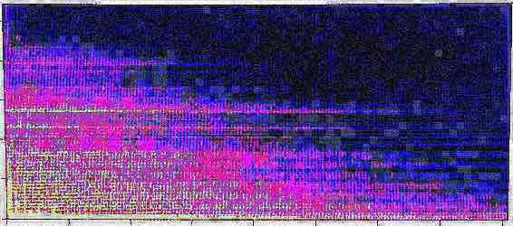

| [Homepage](https://dl4genaudio.github.io) | [Course content](https://dl4genaudio.github.io/#course-content) | [Spanish](https://dl4genaudio-github-io.translate.goog/?_x_tr_sl=en&_x_tr_tl=es&_x_tr_hl=en-US) |

# Deep Learning for Music Information Retrieval: Generative Models

Official website for the graduate-level course covering the deep learning theory, literature, and practice applied to digital audio. More specifically, the course covers generative models (including autoencoders).

Taught at the National Autonomous University of Mexico [UNAM](https://www.unam.mx/) during the spring semester of 2022 (January 31st - May 27th) by [Iran R. Roman](https://iranroman.github.io). Course meets Wednesdays from 5PM to 8PM ([Eastern Standard Time](https://www.timeanddate.com/time/zones/et)) over Zoom. If you are not affiliated with UNAM and are interested in joining the course (it's free, by the way), please email the instructor. The course will welcome students from other institutions. 

## Course content

1. [Introduction and getting all course tools](intro).

## Prerequisites

This is a graduate-level course that assumes knowledge of digital audio signal processing, object-oriented programming (we will work with python3), differential calculus (chain rule), linear algebra, and basic probability/statistics. To ensure that everybody is on the same page, we will review these concepts as they become relevant to course content. However, if you have never been exposed to these concepts, this course will likely be more challenging that what it has to be.

If you need to review these concepts, checkout the following:

* [Introduction to digital filters](https://ccrma.stanford.edu/~jos/filters/filters.html) (make sure you understand everything in Chapter 1)
* [Python review](https://pythonguide.readthedocs.io/en/latest/python/review.html#)
* [Chain rule](https://www.khanacademy.org/math/ap-calculus-ab/ab-differentiation-2-new/ab-3-1a/a/chain-rule-review)
* [Linear algebra](https://cs229.stanford.edu/section/cs229-linalg.pdf) (at least sections 1, 2, and most of 3)
* [Normal distribution](https://en.wikipedia.org/wiki/Normal_distribution)

Or make an online search for other materials covering these concepts. 

## Getting help

Post your questions on the course sub-reddit [deeplearningaudio](https://reddit.com/r/deeplearningaudio).

___

&copy; [Iran R. Roman](https://iranroman.github.io) 2022
