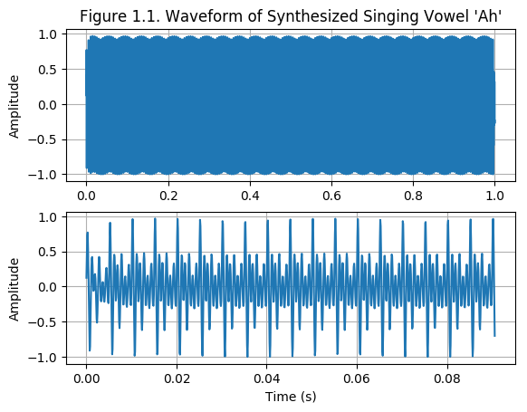
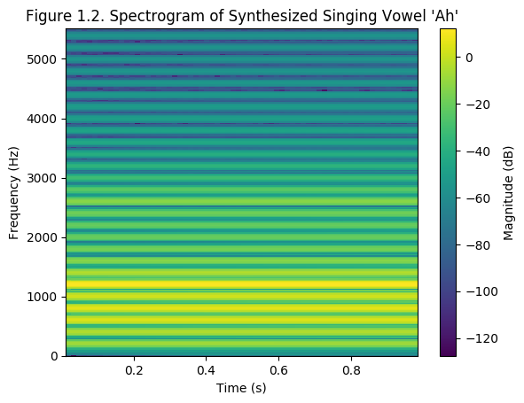

| [Homepage](https://dl4genaudio.github.io) | [Course content](https://dl4genaudio.github.io/#course-content) | [Spanish](https://dl4genaudio-github-io.translate.goog/intro/?_x_tr_sl=auto&_x_tr_tl=es&_x_tr_hl=en-US&_x_tr_pto=wapp) |

# Course goal: to understand, develop, and use deep generative models

## Example Generative models

* [Generation of parameters for a music synthesizer](https://acids-ircam.github.io/flow_synthesizer/)

* [Generating faces](https://towardsdatascience.com/generating-new-faces-with-variational-autoencoders-d13cfcb5f0a8)

* [MusicVAE](https://magenta.tensorflow.org/music-vae)

# Digital audio: review of fundamentals

## Analog-to-digital conversion

* Sounds are pressure waves moving over time and space.

* The movement of pressure waves can be sensed by a membrane (i.e. such as the ones in a microphone) as they move through the membrane.

* The membrane's back-and-forth motions can be "digitized".

* Digitizing involves sampling and quatization.

* Digitization of a "time signal" requires the use of filtering to avoid aliasing of frequency content. 

* Exercise: draw the signal-flow diagram in an analog to digital converter. Include as much detail as possible.

* After proper digitization, we end up with a "time-series" signal with an associated sampling rate, bit depth, and computer number format.

* Stop and think: is the dimensionality of digital audio small or big? What are benefits and pitfalls that result from this? Is digital audio data dense or sparse?

## The Discrete Fourier Transform (DFT)

* Analizing the content of a digital signal is hard in the time domain.

* Very often, the most important content of digital time-domain signals relates to frequencies (i.e. pitch, envelopes, oscillations, etc.). 

* Fortunately, we can use the [DFT](https://ccrma.stanford.edu/~jos/st/DFT_Definition.html) to convert a discrete signal (or function) into a complex-valued function of frequency. 

* The DFT is a simple matrix-vector operation (dot product of the finite signal *x(t)* with each row of the complex-valued DFT matrix).

* In the frequency domain, we can measure the magnitude (or energy, usually in decibels) in each of the frequency bins that we obtain after carrying out the DFT. 

* Figure 1.2 shows a spectrogram. What is the relationship between a spectrogram and the DFT?

* Stop and think: does the DFT create or solve issues associated with the dimensionality of digital audio?

# [Homework 1: Digital audio and the DFT](https://github.com/dl4genaudio/assignments/hw1.ipynb) 

due Feb 8th, 11:59PM [Eastern Standard Time](https://www.timeanddate.com/time/zones/et)

___ 

&copy; [Iran R. Roman](https://iranroman.github.io) 2022

